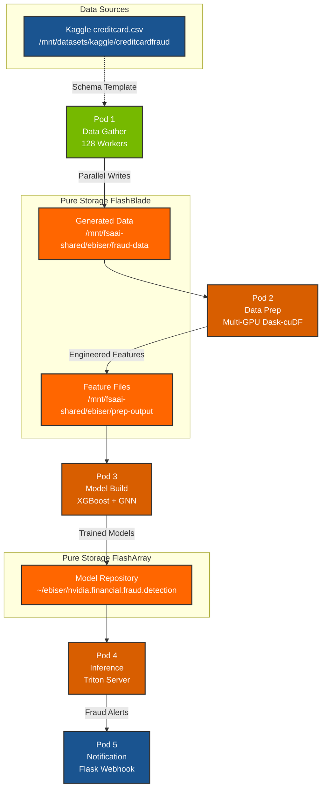

# Financial Fraud Detection Pipeline

[](https://www.nvidia.com/)
[](https://www.docker.com/)
[](https://rapids.ai/)
[](https://www.purestorage.com/products/unstructured-data-storage/flashblade-s.html)
[](https://www.purestorage.com/products/unified-block-file-storage.html)

A containerized fraud detection pipeline demonstrating high-performance AI/ML workflows on Pure Storage with NVIDIA GPUs.

## Overview

This project implements the [NVIDIA Financial Fraud Detection AI Blueprint](https://github.com/NVIDIA-AI-Blueprints/Financial-Fraud-Detection) as a 5-pod containerized architecture, optimized for Pure Storage FlashBlade (high-throughput) and FlashArray (low-latency) storage tiers.

**Key Demonstrations:**
- Pure Storage appliances for parallel I/O for data generation and feature engineering and low latency model serving
- Multi-GPU processing with RAPIDS Dask-cuDF
- End-to-end ML pipeline from data generation to real-time inference

## Architecture



**Color Legend:**
- 🟢 **Green**: CPU-only pods
- 🟠 **Orange**: GPU-accelerated pods
- 🔵 **Blue**: Support services
- 🟧 **Pure Orange**: Pure Storage FA/FB

## Pods

| Pod | Container | GPU | Description |
|-----|-----------|-----|-------------|
| 1 | `data-gather` | - | Generates synthetic transaction data at scale |
| 2 | `data-prep` | Multi-GPU | RAPIDS Dask-cuDF feature engineering |
| 3 | `model-build` | GPU | Trains XGBoost and GNN fraud detection models |
| 4 | `inference` | GPU | NVIDIA Triton Inference Server |
| 5 | `notification` | - | Fraud alert webhook service |

## Storage Architecture

This demo showcases Pure Storage tiered storage for AI/ML workloads:

| Storage Tier | Product | Use Case | Mount Point |
|--------------|---------|----------|-------------|
| High-Throughput | FlashBlade | Data generation, feature files | `/mnt/fsaai-shared/` |
| Low-Latency | FlashArray | Model repository, inference | `~/ebiser/nvidia.financial.fraud.detection/` |

### Data Flow

```
FlashBlade: /mnt/fsaai-shared/ebiser/
├── fraud-data/                    # Pod 1 output
│   └── run_YYYYMMDD_HHMMSS/      # Timestamped runs
│       ├── worker_000_00001.parquet
│       └── ...
└── prep-output/                   # Pod 2 output
    ├── features_run_*.parquet    # Engineered features
    └── metadata_run_*.json       # Feature metadata

FlashArray: ~/ebiser/nvidia.financial.fraud.detection/
└── model_repository/             # Pod 3 output, Pod 4 input
    └── fraud_xgboost/
        ├── config.pbtxt
        └── 1/model.json
```

## Quick Start

### Prerequisites

- Docker with NVIDIA Container Toolkit
- NVIDIA GPU(s) - tested with 2x L40S
- Pure Storage mounts configured
- [Kaggle Credit Card Fraud Dataset](https://www.kaggle.com/datasets/mlg-ulb/creditcardfraud) (template)

### Build and Run

```bash
# Clone repository
git clone <repository-url>
cd financial-fraud-demo

# Build all containers
docker-compose build

# Run data generation (5 minutes default)
docker-compose up data-gather

# Run feature engineering (watches for new data)
docker-compose up data-prep

# Run model training
docker-compose up model-build

# Start inference service
docker-compose up inference notification
```

## Pod Details

### Pod 1: Data Gather

Generates synthetic credit card transaction data matching the Kaggle schema using parallel workers.

**Configuration:**
| Variable | Default | Description |
|----------|---------|-------------|
| `NUM_WORKERS` | 128 | Parallel worker processes |
| `DURATION_SECONDS` | 300 | Generation duration |
| `CHUNK_SIZE` | 2000000 | Rows per output file |
| `OUTPUT_FORMAT` | parquet | Output format (parquet/csv/binary) |

**Example Output:**
```
======================================================================
Pod 1: Financial Fraud Data Generator
======================================================================
Output directory: /mnt/fsaai-shared/ebiser/fraud-data/run_20251226_193027
Workers:    128
Duration:   300 seconds
Format:     parquet
----------------------------------------------------------------------
[  30s] Files:  128 | Size:  45.00 GB | Speed: 1.01 GB/s | Workers: 128
```

### Pod 2: Data Prep (Multi-GPU)

GPU-accelerated feature engineering using RAPIDS Dask-cuDF for multi-GPU parallelism.

**Features:**
- Automatic multi-GPU distribution via Dask LocalCUDACluster
- Standard scaling for PCA columns (V1-V28)
- Time-based features (hour_of_day, is_night)
- Interaction features (V1*V2, amount*V1)
- Graceful fallback to single-GPU if Dask fails

**Configuration:**
| Variable | Default | Description |
|----------|---------|-------------|
| `MAX_FILES_PER_RUN` | 100 | Files to process per run |
| `USE_MULTI_GPU` | true | Enable Dask multi-GPU |
| `LATEST_ONLY` | true | Process only newest run |

**Example Output:**
```
============================================================
Pod 2: Data Prep Service (RAPIDS cuDF)
============================================================
GPU: 2x NVIDIA L40S (44GB each)
Multi-GPU: ENABLED (2 GPUs via Dask)
  Dask cluster ready: http://127.0.0.1:8787/status
------------------------------------------------------------
Processing: run_20251226_193027
  Multi-GPU loading 100 files across 2 GPUs...
  Created 200 partitions across 2 GPUs
  Complete: 200,000,000 records in 45.2s (4.4M rec/s) [multi-GPU]
Feature engineering on 200,000,000 records (31 columns)...
  Added 11 features in 1.8s (111.1M rec/s)
Writing 200,000,000 records to features_run_20251226_193027.parquet...
SUCCESS: run_20251226_193027 (total: 185.3s)
============================================================
Waiting for new data in fraud-data... (1 processed)
```

### Pod 3: Model Build

Trains XGBoost classifier with GPU acceleration.

**Models:**
- XGBoost binary classifier (GPU-accelerated)
- GNN embeddings (placeholder for PyTorch Geometric)

**Output:**
- Triton-compatible model repository
- Optional S3 versioning for model archives

### Pod 4: Inference

NVIDIA Triton Inference Server for real-time fraud detection.

**Endpoints:**
| Port | Protocol | Description |
|------|----------|-------------|
| 8000 | HTTP | REST API |
| 8001 | gRPC | High-performance inference |
| 8002 | HTTP | Prometheus metrics |

### Pod 5: Notification

Flask webhook service for fraud alerts.

**Endpoints:**
- `POST /notify/fraud` - Receive fraud alerts
- `GET /alerts` - List recent alerts
- `GET /alerts/stats` - Alert statistics

## Performance Benchmarks

Tested on: 2x NVIDIA L40S (44GB each), Pure Storage FlashBlade

| Metric | Single GPU | Multi-GPU (2x) |
|--------|------------|----------------|
| Data Loading | 2.4M rec/s | 4.4M rec/s |
| Feature Engineering | 116M rec/s | 111M rec/s |
| Total Pipeline (100M records) | ~180s | ~95s |

## Configuration

### Environment Variables

Create a `.env` file or export these variables:

```bash
# Storage mounts
FB_MOUNT=/mnt/fsaai-shared/ebiser
FB_OUTPUT_MOUNT=/mnt/fsaai-shared/ebiser/fraud-data
FA_MOUNT=~/ebiser/nvidia.financial.fraud.detection
TEMPLATE_MOUNT=/mnt/datasets/kaggle/creditcardfraud

# Pod 1: Data generation
NUM_WORKERS=128
DURATION_SECONDS=300
CHUNK_SIZE=2000000
OUTPUT_FORMAT=parquet

# Pod 2: Feature engineering
MAX_FILES_PER_RUN=100
USE_MULTI_GPU=true
LATEST_ONLY=true

# Pod 3: Model versioning (optional)
S3_ENDPOINT=https://flashblade.example.com
S3_ACCESS_KEY=your-key
S3_SECRET_KEY=your-secret
S3_BUCKET=fraud-models
```

## Troubleshooting

### Multi-GPU not detected

```bash
# Verify NVIDIA runtime
docker run --rm --gpus all nvidia/cuda:12.4.0-base-ubuntu22.04 nvidia-smi

# Check Dask dashboard (during data-prep run)
# URL shown in logs: http://127.0.0.1:8787/status
```

### Out of memory errors

```bash
# Reduce files per run
MAX_FILES_PER_RUN=50 docker-compose up data-prep

# Or disable multi-GPU (uses chunked loading)
USE_MULTI_GPU=false docker-compose up data-prep
```

### FlashBlade connectivity

```bash
# Verify mount
ls -la /mnt/fsaai-shared/ebiser/

# Check permissions
touch /mnt/fsaai-shared/ebiser/fraud-data/test && rm /mnt/fsaai-shared/ebiser/fraud-data/test
```

## License

Apache License 2.0

## Acknowledgments

- [NVIDIA Financial Fraud Detection Blueprint](https://github.com/NVIDIA-AI-Blueprints/Financial-Fraud-Detection)
- [RAPIDS AI](https://rapids.ai/)
- [Kaggle Credit Card Fraud Dataset](https://www.kaggle.com/datasets/mlg-ulb/creditcardfraud)