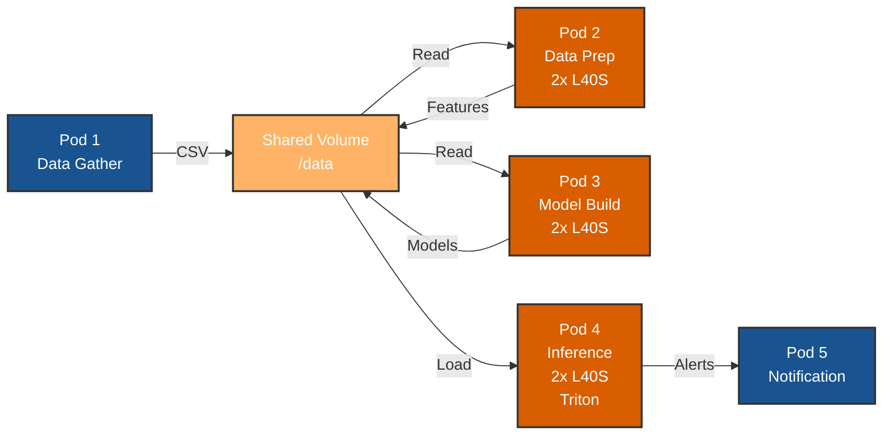

# financial-fraud-demo

[](https://www.nvidia.com/)
[](https://www.docker.com/)
[](https://rapids.ai/)

## Overview

A containerized fraud detection pipeline optimized for dual NVIDIA L40S GPUs. This project re-architects the NVIDIA Financial Fraud Detection AI Blueprint into 5 independent Docker containers that work together to process transactions, train models, and detect fraud in real-time.

This project is a redevelopment focusing on WHY PURE? of the **Original Blueprint**: [NVIDIA Financial Fraud Detection](https://github.com/NVIDIA-AI-Blueprints/Financial-Fraud-Detection)

---

## System Architecture



---

## 5-Pod Architecture

| Pod | Container | GPU | Purpose |
|-----|-----------|-----|---------|
| 1 | `data-gather` | No | Generate/ingest raw transaction data |
| 2 | `data-prep` | 2x L40S | GPU-accelerated feature engineering (RAPIDS) |
| 3 | `model-build` | 2x L40S | Train GNN and XGBoost models |
| 4 | `inference` | 2x L40S | Real-time fraud detection (Triton Server) |
| 5 | `notification` | No | Handle fraud alerts via webhook |

**Data Flow**: Raw data → Prepared features → Trained models → Real-time predictions → Alerts

---

## Technology Stack

- **GPUs**: 2x NVIDIA L40S (48GB each)
- **Data Processing**: RAPIDS (cuDF, cuGraph)
- **ML Training**: cuXGBoost, PyTorch
- **Inference**: NVIDIA Triton Inference Server
- **Orchestration**: Docker Compose
- **Storage**: Shared Docker volume (`/data`)

---

## Quick Start

### Prerequisites

```bash
# Required
- NVIDIA Driver >= 525.x
- Docker >= 24.x
- Docker Compose >= 2.x
- NVIDIA Container Toolkit

# Verify GPU access
nvidia-smi
docker run --rm --gpus all nvidia/cuda:12.2.0-base-ubuntu22.04 nvidia-smi
```

### Installation

```bash
# Clone repository
git clone https://github.com/yourusername/nvidia-fraud-detection-pipeline.git
cd nvidia-fraud-detection-pipeline

# Create shared data directory
mkdir -p ./data/{raw_data,prep_output,model_repository}

# Build all containers
docker-compose build

# Start the pipeline
docker-compose up
```

---

## Project Structure

```
nvidia-fraud-detection-pipeline/
├── docker-compose.yaml
├── data/                      # Shared volume
│   ├── raw_data/
│   ├── prep_output/
│   └── model_repository/
├── pods/
│   ├── 1-data-gather/
│   │   ├── Dockerfile
│   │   └── gather.py
│   ├── 2-data-prep/
│   │   ├── Dockerfile
│   │   └── prep.py
│   ├── 3-model-build/
│   │   ├── Dockerfile
│   │   └── train.py
│   ├── 4-inference/
│   │   ├── Dockerfile
│   │   └── config/
│   └── 5-notification/
│       ├── Dockerfile
│       └── app.py
└── README.md
```

---

## Usage

### Run Complete Pipeline

```bash
# Start all containers
docker-compose up

# Run in background
docker-compose up -d

# View logs
docker-compose logs -f
```

### Run Individual Pods

```bash
# Pod 1: Generate data
docker-compose up data-gather

# Pod 2: Prepare features (requires data from Pod 1)
docker-compose up data-prep

# Pod 3: Train models (requires data from Pod 2)
docker-compose up model-build

# Pods 4 & 5: Start inference and notification services
docker-compose up inference notification
```

### Test Inference Endpoint

```bash
# Send test transaction
curl -X POST http://localhost:8000/v2/models/fraud_xgboost/infer \
  -H "Content-Type: application/json" \
  -d '{
    "inputs": [{
      "name": "features",
      "shape": [1, 50],
      "datatype": "FP32",
      "data": [0.5, 0.3, 0.8, ...]
    }]
  }'
```

---

## Docker Compose Configuration

```yaml
version: '3.8'

services:
  data-gather:
    build: ./pods/1-data-gather
    volumes:
      - ./data:/data
    
  data-prep:
    build: ./pods/2-data-prep
    volumes:
      - ./data:/data
    deploy:
      resources:
        reservations:
          devices:
            - driver: nvidia
              count: 2
              capabilities: [gpu]
    
  model-build:
    build: ./pods/3-model-build
    volumes:
      - ./data:/data
    deploy:
      resources:
        reservations:
          devices:
            - driver: nvidia
              count: 2
              capabilities: [gpu]
    
  inference:
    build: ./pods/4-inference
    ports:
      - "8000:8000"  # HTTP
      - "8001:8001"  # gRPC
      - "8002:8002"  # Metrics
    volumes:
      - ./data:/data
    deploy:
      resources:
        reservations:
          devices:
            - driver: nvidia
              count: 2
              capabilities: [gpu]
    
  notification:
    build: ./pods/5-notification
    ports:
      - "5000:5000"
```

---

## Data Flow

### Storage Paths

```bash
/data/
├── raw_data/
│   └── transactions.csv              # Pod 1 writes
├── prep_output/
│   ├── features.parquet              # Pod 2 writes
│   └── graph_edges.csv
└── model_repository/
    ├── fraud_gnn/
    │   └── 1/model.pt                # Pod 3 writes
    └── fraud_xgboost/
        └── 1/model.json              # Pod 4 reads
```

### Pipeline Flow

1. **Pod 1** generates synthetic transactions → `/data/raw_data/`
2. **Pod 2** reads raw data, processes with RAPIDS → `/data/prep_output/`
3. **Pod 3** reads features, trains models → `/data/model_repository/`
4. **Pod 4** loads models, serves predictions via Triton
5. **Pod 5** receives alerts from Pod 4 when fraud detected

---

## Monitoring

```bash
# Check GPU usage
watch -n 1 nvidia-smi

# View container logs
docker-compose logs -f data-prep
docker-compose logs -f inference

# Check Triton metrics
curl http://localhost:8002/metrics

# Monitor resource usage
docker stats
```

---

## Troubleshooting

### GPU not detected

```bash
# Check NVIDIA runtime
docker run --rm --gpus all nvidia/cuda:12.2.0-base-ubuntu22.04 nvidia-smi

# Verify nvidia-container-toolkit
sudo nvidia-ctk runtime configure --runtime=docker
sudo systemctl restart docker
```

### Container fails to start

```bash
# Check logs
docker-compose logs <service-name>

# Rebuild container
docker-compose build --no-cache <service-name>

# Verify volume permissions
ls -la ./data/
```

### Out of GPU memory

```bash
# Check GPU memory
nvidia-smi

# Stop other GPU processes
docker-compose down

# Reduce batch size in training configs
```

---

## Performance Targets

| Metric | Target |
|--------|--------|
| Data Prep Throughput | > 1M records/sec |
| Model Training Time | < 30 minutes |
| Inference Latency (p99) | < 10ms |
| GPU Utilization | > 85% |

---

## Contributing

1. Fork the repository
2. Create your feature branch (`git checkout -b feature/amazing-feature`)
3. Commit your changes (`git commit -m 'Add amazing feature'`)
4. Push to the branch (`git push origin feature/amazing-feature`)
5. Open a Pull Request

---

## License

Apache License 2.0 - see [LICENSE](LICENSE) file

---

## Acknowledgments

- NVIDIA AI Blueprints Team
- NVIDIA RAPIDS Team
- NVIDIA Triton Inference Server Team


---

**Built for High-Performance Fraud Detection with Docker & NVIDIA L40S GPUs**

### References

- [NVIDIA Financial Fraud Detection Blueprint](https://docs.nvidia.com/ai-blueprints/)
- [RAPIDS Documentation](https://docs.rapids.ai/)
- [Triton Inference Server](https://github.com/triton-inference-server/server)
- [NVIDIA GPU Operator](https://docs.nvidia.com/datacenter/cloud-native/gpu-operator/)

---

## 📞 Contact

**Project Maintainers**: Emir Biser and Ed Hsu - your friendly AAI FSAs

- 📧 Email: ebiser@purestorage.com and ehsu@purestorage.com

**Repository**: [https://github.com/yourusername/nvidia-fraud-detection-pipeline](https://github.com/yourusername/nvidia-fraud-detection-pipeline)

---

## 🎯 Roadmap

- [ ] Add streaming data ingestion support (Kafka integration)
- [ ] Implement A/B testing for model versions
- [ ] Add automated model retraining pipeline
- [ ] Integrate with MLflow for experiment tracking
- [ ] Support for additional GPU architectures (A100, H100)
- [ ] Add comprehensive benchmark suite
- [ ] Develop web-based monitoring dashboard

---