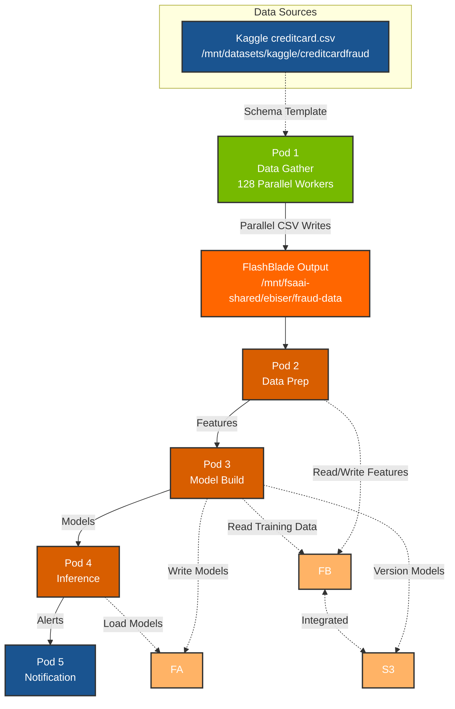

# NVIDIA Financial Fraud Detection Pipeline

[](https://www.nvidia.com/)
[](https://www.docker.com/)
[](https://rapids.ai/)
[](https://www.purestorage.com/products/unified-block-file-storage.html)
[](https://www.purestorage.com/products/unstructured-data-storage/flashblade-s.html)

## Overview

A containerized fraud detection pipeline optimized for dual NVIDIA L40S GPUs. This project re-architects the NVIDIA Financial Fraud Detection AI Blueprint into 5 independent Docker containers that work together to process transactions, train models, and detect fraud in real-time.

**Pod 1** serves as a high-performance stress-testing tool for Pure Storage FlashBlade, generating massive synthetic transaction data using 128 parallel workers.

**Original Blueprint**: [NVIDIA Financial Fraud Detection](https://github.com/NVIDIA-AI-Blueprints/Financial-Fraud-Detection)

---

## System Architecture



---

## 5-Pod Architecture

| Pod | Container | GPU | Storage | Purpose |
|-----|-----------|-----|---------|---------|
| 1 | `data-gather` | No | Template (RO) + FB (RW) | **FlashBlade stress test**: 128 parallel workers generating synthetic transactions from Kaggle schema |
| 2 | `data-prep` | 2x L40S | FB | GPU-accelerated feature engineering (RAPIDS) |
| 3 | `model-build` | 2x L40S | FB + FA + S3 | Train GNN and XGBoost models |
| 4 | `inference` | 2x L40S | FA | Real-time fraud detection (Triton Server) |
| 5 | `notification` | No | None | Handle fraud alerts via webhook |

**Data Flow**: Template Schema (Kaggle) → Parallel Generation (Pod 1) → FlashBlade → Feature Engineering (Pod 2) → Models (FA) → Predictions → Alerts

**Storage Strategy**:

### Input Template (Read-Only)
- **Path**: `/mnt/datasets/kaggle/creditcardfraud/creditcard.csv`
- **Purpose**: Schema template for synthetic data generation
- **Usage**: Pod 1 reads column structure and data distributions

### FlashBlade Output (High-Throughput Write)
- **Path**: `/mnt/fsaai-shared/ebiser/fraud-data`
- **Protocol**: NFS file mount
- **Optimized for**: Sustained parallel write I/O from 128 workers
- **Use case**: Stress testing FlashBlade with continuous append operations
- **Pods**: Pod 1 (writes), Pod 2 (reads)

### FlashBlade Features (Parallel I/O)
- **Path**: `/mnt/fsaai-shared/ebiser`
- **Protocol**: NFS file mount
- **Optimized for**: High-throughput parallel I/O (>5GB/s)
- **Use case**: Bulk data processing with multiple GPU workers
- **Pods**: Pod 2 (reads/writes features), Pod 3 (reads training data)

### FlashArray (Low-Latency)
- **Path**: `~/ebiser/nvidia.financial.fraud.detection`
- **Protocol**: NFS file mount
- **Optimized for**: Low-latency random I/O (<1ms read latency)
- **Use case**: Real-time model serving
- **Pods**: Pod 3 (writes models), Pod 4 (reads models)

### S3 Object Storage (Archival)
- **Endpoint**: `s3://fraud-detection-bucket`
- **Protocol**: S3 API on FlashBlade
- **Use case**: Model versioning and long-term archival

---

## Infrastructure and Technology Stack

- **GPUs**: 2x NVIDIA L40S (48GB each)
- **Data Processing**: RAPIDS (cuDF, cuGraph)
- **ML Training**: cuXGBoost, PyTorch
- **Inference**: NVIDIA Triton Inference Server
- **Orchestration**: Docker Compose
- **Storage**: 
  - **FA (FlashArray X70R3)**: Low-latency file storage
  - **FB (FlashBlade S200)**: Parallel I/O, file + S3 protocol

---

## Quick Start

### Prerequisites

```bash
# Required Hardware
- 2x NVIDIA L40S GPUs (48GB each)
- 1024 GB RAM (512 GB per CPU)
- Pure Storage FlashArray (FA)
- Pure Storage FlashBlade (FB)

# Required Software
- Ubuntu 22.04.5 LTS
- NVIDIA Driver >= 550.x (CUDA 12.4)
- Docker >= 24.x
- Docker Compose >= 2.x
- NVIDIA Container Toolkit

# Required Data
- Kaggle Credit Card Fraud Dataset: creditcard.csv
  Download from: https://www.kaggle.com/datasets/mlg-ulb/creditcardfraud

# Verify GPU access
nvidia-smi
docker run --rm --gpus all nvidia/cuda:12.4.0-base-ubuntu22.04 nvidia-smi
```

### Installation

```bash
# Clone repository
git clone https://github.com/yourusername/nvidia-fraud-detection-pipeline.git
cd nvidia-fraud-detection-pipeline

# Configure storage mount points
export TEMPLATE_MOUNT=/mnt/datasets/kaggle/creditcardfraud
export FB_OUTPUT_MOUNT=/mnt/fsaai-shared/ebiser/fraud-data
export FB_MOUNT=/mnt/fsaai-shared/ebiser
export FA_MOUNT=~/ebiser/nvidia.financial.fraud.detection

# Create required directories
mkdir -p $FB_OUTPUT_MOUNT
mkdir -p $FB_MOUNT/{raw_data,prep_output}
mkdir -p $FA_MOUNT/model_repository

# Ensure Kaggle dataset is available
ls $TEMPLATE_MOUNT/creditcard.csv

# Build all containers
docker-compose build

# Start the pipeline
docker-compose up
```

---

## Data Generation Demo

Pod 1 (`data-gather`) is designed as a **FlashBlade stress-testing tool** that demonstrates Pure Storage's high-throughput capabilities.

### How It Works

1. **Schema Loading**: Reads `creditcard.csv` to extract column structure and statistical distributions
2. **Parallel Generation**: Spawns 128 worker threads, each writing to a dedicated file
3. **Continuous Append**: Workers generate and append 10,000-row chunks continuously
4. **Real-Time Metrics**: Prints throughput statistics every 5 seconds

### Running the Stress Test

```bash
# Run with default settings (5 minutes, 128 workers)
docker-compose up data-gather

# Custom configuration
NUM_WORKERS=256 DURATION_SECONDS=600 docker-compose up data-gather

# Quick test (1 minute, 64 workers)
NUM_WORKERS=64 DURATION_SECONDS=60 docker-compose up data-gather
```

### Interpreting Throughput Metrics

The console output shows real-time performance:

```
[  30.0s] Records: 12,500,000 | Size: 2.45 GB | Throughput: 850.2 MB/s | Rate: 425,000 rec/s
[  35.0s] Records: 14,750,000 | Size: 2.89 GB | Throughput: 892.1 MB/s | Rate: 450,000 rec/s
```

| Metric | Description | Target |
|--------|-------------|--------|
| **Records** | Total synthetic transactions generated | Continuous growth |
| **Size** | Total data written to FlashBlade | 10+ GB in 5 min |
| **Throughput** | Current write speed (MB/s) | >500 MB/s |
| **Rate** | Records generated per second | >100,000 rec/s |

### Performance Tuning

| Environment Variable | Default | Description |
|---------------------|---------|-------------|
| `NUM_WORKERS` | 128 | Parallel worker threads |
| `DURATION_SECONDS` | 300 | Test duration (5 minutes) |
| `CHUNK_SIZE` | 10000 | Rows per write operation |

**Tips for Maximum Throughput:**
- Increase `NUM_WORKERS` if CPU utilization is low
- Increase `CHUNK_SIZE` for fewer, larger I/O operations
- Monitor FlashBlade metrics during the test
- Ensure network bandwidth is not the bottleneck

### Output Files

After the test completes, you'll find:

```bash
/mnt/fsaai-shared/ebiser/fraud-data/
├── thread_000_data.csv
├── thread_001_data.csv
├── ...
└── thread_127_data.csv
```

Each file contains synthetic credit card transactions matching the Kaggle dataset schema (V1-V28 features, Time, Amount, Class).

---

## Project Structure

```
nvidia-fraud-detection-pipeline/
├── docker-compose.yaml           # Container orchestration
├── pods/
│   ├── data-gather/
│   │   ├── Dockerfile
│   │   ├── gather.py            # High-performance parallel generator
│   │   └── requirements.txt
│   ├── data-prep/
│   │   ├── Dockerfile
│   │   └── prep.py
│   ├── model-build/
│   │   ├── Dockerfile
│   │   └── train.py
│   ├── inference/
│   │   ├── Dockerfile
│   │   └── config/
│   └── notification/
│       ├── Dockerfile
│       └── app.py
└── README.md

# Storage Mounts
Template (RO): /mnt/datasets/kaggle/creditcardfraud/
    └── creditcard.csv                 # Schema template

FB Output: /mnt/fsaai-shared/ebiser/fraud-data/
    ├── thread_000_data.csv            # Pod 1 parallel output
    ├── thread_001_data.csv
    └── ...

FB: /mnt/fsaai-shared/ebiser/
    └── prep_output/                   # Pod 2 feature output

FA: ~/ebiser/nvidia.financial.fraud.detection/
    └── model_repository/              # Low-latency model storage
        ├── fraud_gnn/
        └── fraud_xgboost/

S3: s3://fraud-detection-bucket/       # Archival and versioning
    └── model_versions/
```

---

## Usage

See `docker-compose.yaml` for complete container orchestration configuration.

### Run Complete Pipeline

```bash
# Start all containers
docker-compose up

# Run in background
docker-compose up -d

# View logs
docker-compose logs -f
```

### Run Individual Pods

```bash
# Pod 1: FlashBlade stress test (data generation)
docker-compose up data-gather

# Pod 2: Prepare features (requires data from Pod 1)
docker-compose up data-prep

# Pod 3: Train models (requires data from Pod 2)
docker-compose up model-build

# Pods 4 & 5: Start inference and notification services
docker-compose up inference notification
```

### Test Inference Endpoint

```bash
# Check Triton server health
curl http://localhost:8002/v2/health/ready

# Check notification service
curl http://localhost:5000/health

# Send test transaction (once models are trained)
curl -X POST http://localhost:8000/v2/models/fraud_xgboost/infer \
  -H "Content-Type: application/json" \
  -d '{
    "inputs": [{
      "name": "input__0",
      "shape": [1, 30],
      "datatype": "FP32",
      "data": [0.0, -1.359, -0.072, ..., 149.62]
    }]
  }'
```

---

## Data Flow

### Storage Paths

**Template Input (Read-Only):**
```bash
/mnt/datasets/kaggle/creditcardfraud/
└── creditcard.csv                    # Kaggle schema template
```

**FlashBlade Output (High-Throughput):**
```bash
/mnt/fsaai-shared/ebiser/fraud-data/
├── thread_000_data.csv               # Pod 1 worker outputs
├── thread_001_data.csv
├── ...
└── thread_127_data.csv
```

**FlashArray (Low Latency):**
```bash
~/ebiser/nvidia.financial.fraud.detection/
└── model_repository/
    ├── fraud_gnn/
    │   ├── config.pbtxt
    │   └── 1/model.pt                # Pod 3 writes, Pod 4 reads
    └── fraud_xgboost/
        ├── config.pbtxt
        └── 1/model.json              # Pod 3 writes, Pod 4 reads
```

### Pipeline Flow

1. **Pod 1** reads schema from `/mnt/datasets/kaggle/creditcardfraud/creditcard.csv`
2. **Pod 1** spawns 128 workers (default) → writes parallel CSV files to **FlashBlade** `/fraud-data/`
3. **Pod 2** reads generated data, processes with RAPIDS → **FlashBlade** `/prep_output/`
4. **Pod 3** reads features from **FlashBlade**, trains models → **FlashArray** `/model_repository/`
5. **Pod 4** loads models from **FlashArray**, serves predictions via Triton
6. **Pod 5** receives alerts from Pod 4 when fraud detected

---

## Monitoring

```bash
# Watch data generation throughput (Pod 1 logs)
docker-compose logs -f data-gather

# Check GPU usage (Pods 2, 3, 4)
watch -n 1 nvidia-smi

# View container logs
docker-compose logs -f data-prep

# Check Triton metrics
curl http://localhost:8002/metrics

# Monitor resource usage
docker stats

# Check FlashBlade I/O during stress test
iostat -x 1 /mnt/fsaai-shared/ebiser/fraud-data

# Check FlashArray latency
iostat -x 1 ~/ebiser/nvidia.financial.fraud.detection
```

---

## Troubleshooting

### Pod 1: Data generation not reaching expected throughput

```bash
# Check worker count
docker-compose logs data-gather | grep "workers started"

# Verify template file exists
ls -la /mnt/datasets/kaggle/creditcardfraud/creditcard.csv

# Check output directory permissions
ls -la /mnt/fsaai-shared/ebiser/fraud-data/

# Increase file descriptor limits if seeing "Too many open files"
ulimit -n 65536
```

### GPU not detected

```bash
# Check NVIDIA runtime
docker run --rm --gpus all nvidia/cuda:12.2.0-base-ubuntu22.04 nvidia-smi

# Verify nvidia-container-toolkit
sudo nvidia-ctk runtime configure --runtime=docker
sudo systemctl restart docker
```

### Container fails to start

```bash
# Check logs
docker-compose logs <service-name>

# Rebuild container
docker-compose build --no-cache <service-name>

# Verify storage mounts
ls -la /mnt/datasets/kaggle/creditcardfraud/
ls -la /mnt/fsaai-shared/ebiser/fraud-data/
ls -la ~/ebiser/nvidia.financial.fraud.detection/
```

### Out of GPU memory

```bash
# Check GPU memory
nvidia-smi

# Stop other GPU processes
docker-compose down

# Reduce batch size in training configs
```

---

## Performance Targets

| Metric | Target | Storage Component |
|--------|--------|-------------------|
| **Data Generation (Pod 1)** | >500 MB/s | FlashBlade Parallel Write |
| **Data Generation Records** | >100,000 rec/s | FlashBlade Parallel Write |
| Data Prep Throughput | >1M records/sec | FB Parallel I/O |
| Model Training Time | <30 minutes | FB read, FA write |
| Inference Latency (p99) | <10ms | FA low-latency reads |
| GPU Utilization | >85% | Pods 2, 3, 4 |
| Storage Read Latency (FA) | <1ms | Pod 4 |

---

## Contributing

1. Fork the repository
2. Create your feature branch (`git checkout -b feature/amazing-feature`)
3. Commit your changes (`git commit -m 'Add amazing feature'`)
4. Push to the branch (`git push origin feature/amazing-feature`)
5. Open a Pull Request

---

## License

Apache License 2.0 - see [LICENSE](LICENSE) file
