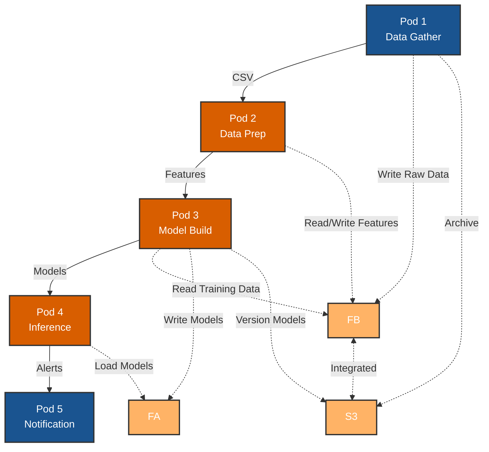

# NVIDIA Financial Fraud Detection Pipeline

[](https://www.nvidia.com/)
[](https://www.docker.com/)
[](https://rapids.ai/)
[](https://www.purestorage.com/products/unified-block-file-storage.html)
[](https://www.purestorage.com/products/unstructured-data-storage/flashblade-s.html)

## Overview

A containerized fraud detection pipeline optimized for dual NVIDIA L40S GPUs. This project re-architects the NVIDIA Financial Fraud Detection AI Blueprint into 5 independent Docker containers that work together to process transactions, train models, and detect fraud in real-time.

**Original Blueprint**: [NVIDIA Financial Fraud Detection](https://github.com/NVIDIA-AI-Blueprints/Financial-Fraud-Detection)

---

## System Architecture



---

## 5-Pod Architecture

| Pod | Container | GPU | Storage | Purpose |
|-----|-----------|-----|---------|---------|
| 1 | `data-gather` | No | FB + S3 | Generate/ingest raw transaction data |
| 2 | `data-prep` | 2x L40S | FB | GPU-accelerated feature engineering (RAPIDS) |
| 3 | `model-build` | 2x L40S | FB + FA + S3 | Train GNN and XGBoost models |
| 4 | `inference` | 2x L40S | FA | Real-time fraud detection (Triton Server) |
| 5 | `notification` | No | None | Handle fraud alerts via webhook |

**Data Flow**: Raw data (FB) → Prepared features (FB) → Trained models (FA) → Real-time predictions → Alerts

**Storage Strategy**:
- **FA (FlashArray X70R3)**: Low-latency model serving and storage
- **FB (FlashBlade S200)**: High-throughput parallel I/O for data processing
- **S3**: Model versioning and raw data archival

---

## Technology Stack

- **GPUs**: 2x NVIDIA L40S (48GB each)
- **Data Processing**: RAPIDS (cuDF, cuGraph)
- **ML Training**: cuXGBoost, PyTorch
- **Inference**: NVIDIA Triton Inference Server
- **Orchestration**: Docker Compose
- **Storage**: 
  - **FA (FlashArray X70R3)**: Low-latency file storage
  - **FB (FlashBlade S200)**: Parallel I/O, file + S3 protocol
  - **S3**: Object storage for archival and versioning

---

## Quick Start

### Prerequisites

```bash
# Required Hardware
- 2x NVIDIA L40S GPUs (48GB each)
- 1024 GB RAM (512 GB per CPU)
- Pure Storage FlashArray X70R3 (FA)
- Pure Storage FlashBlade S200 (FB)
- 4x 25Gb Cisco VIC NICs

# Required Software
- Ubuntu 22.04.5 LTS
- NVIDIA Driver >= 550.x (CUDA 12.4)
- Docker >= 24.x
- Docker Compose >= 2.x
- NVIDIA Container Toolkit

# Verify GPU access
nvidia-smi
docker run --rm --gpus all nvidia/cuda:12.4.0-base-ubuntu22.04 nvidia-smi
```

### Installation

```bash
# Clone repository
git clone https://github.com/yourusername/nvidia-fraud-detection-pipeline.git
cd nvidia-fraud-detection-pipeline

# Configure storage mount points
export FA_MOUNT=~/ebiser/nvidia.financial.fraud.detection
export FB_MOUNT=/mnt/fsaai-shared/ebiser

# Create required directories
mkdir -p $FB_MOUNT/{raw_data,prep_output}
mkdir -p $FA_MOUNT/model_repository

# Build all containers
docker-compose build

# Start the pipeline
docker-compose up
```

---

## Project Structure

```
nvidia-fraud-detection-pipeline/
├── docker-compose.yaml           # Container orchestration
├── pods/
│   ├── data-gather/
│   │   ├── Dockerfile
│   │   └── gather.py
│   ├── data-prep/
│   │   ├── Dockerfile
│   │   └── prep.py
│   ├── model-build/
│   │   ├── Dockerfile
│   │   └── train.py
│   ├── inference/
│   │   ├── Dockerfile
│   │   └── config/
│   └── notification/
│       ├── Dockerfile
│       └── app.py
└── README.md

# Storage Mounts (Pure Storage)
FA: ~/ebiser/nvidia.financial.fraud.detection/
    └── model_repository/              # Low-latency model storage
        ├── fraud_gnn/
        └── fraud_xgboost/

FB: /mnt/fsaai-shared/ebiser/
    ├── raw_data/                      # High-throughput data ingestion
    └── prep_output/                   # Parallel feature processing

S3: s3://fraud-detection-bucket/       # Archival and versioning
    ├── raw_archives/
    └── model_versions/
```

---

## Usage

See `docker-compose.yaml` for complete container orchestration configuration.

### Run Complete Pipeline

```bash
# Start all containers
docker-compose up

# Run in background
docker-compose up -d

# View logs
docker-compose logs -f
```

### Run Individual Pods

```bash
# Pod 1: Generate data
docker-compose up data-gather

# Pod 2: Prepare features (requires data from Pod 1)
docker-compose up data-prep

# Pod 3: Train models (requires data from Pod 2)
docker-compose up model-build

# Pods 4 & 5: Start inference and notification services
docker-compose up inference notification
```

### Test Inference Endpoint

```bash
# Check Triton server health
curl http://localhost:8002/v2/health/ready

# Check notification service
curl http://localhost:5000/health

# Send test transaction (once models are trained)
curl -X POST http://localhost:8000/v2/models/fraud_xgboost/infer \
  -H "Content-Type: application/json" \
  -d '{
    "inputs": [{
      "name": "input__0",
      "shape": [1, 50],
      "datatype": "TYPE_FP32",
      "data": [0.5, 0.3, 0.8, ...]
    }]
  }'
```

---

## Docker Compose Configuration

```yaml
version: '3.8'

services:
  data-gather:
    build: ./pods/1-data-gather
    volumes:
      - ./data:/data
    
  data-prep:
    build: ./pods/2-data-prep
    volumes:
      - ./data:/data
    deploy:
      resources:
        reservations:
          devices:
            - driver: nvidia
              count: 2
              capabilities: [gpu]
    
  model-build:
    build: ./pods/3-model-build
    volumes:
      - ./data:/data
    deploy:
      resources:
        reservations:
          devices:
            - driver: nvidia
              count: 2
              capabilities: [gpu]
    
  inference:
    build: ./pods/4-inference
    ports:
      - "8000:8000"  # HTTP
      - "8001:8001"  # gRPC
      - "8002:8002"  # Metrics
    volumes:
      - ./data:/data
    deploy:
      resources:
        reservations:
          devices:
            - driver: nvidia
              count: 2
              capabilities: [gpu]
    
  notification:
    build: ./pods/5-notification
    ports:
      - "5000:5000"
```

---

## Data Flow

### Storage Paths

**FlashArray (FA) - Low Latency:**
```bash
~/ebiser/nvidia.financial.fraud.detection/
└── model_repository/
    ├── fraud_gnn/
    │   ├── config.pbtxt
    │   └── 1/model.pt                # Pod 3 writes, Pod 4 reads
    └── fraud_xgboost/
        ├── config.pbtxt
        └── 1/model.json              # Pod 3 writes, Pod 4 reads
```

**FlashBlade (FB) - Parallel I/O:**
```bash
/mnt/fsaai-shared/ebiser/
├── raw_data/
│   └── transactions.csv              # Pod 1 writes
└── prep_output/
    ├── features.parquet              # Pod 2 writes, Pod 3 reads
    ├── graph_nodes.csv
    └── graph_edges.csv
```

**S3 - Archival & Versioning:**
```bash
s3://fraud-detection-bucket/
├── raw_archives/
│   └── transactions_2024-12-01.csv   # Pod 1 archives
└── model_versions/
    ├── fraud_gnn_v1.0.tar.gz         # Pod 3 versions
    └── fraud_xgboost_v1.0.tar.gz
```

### Pipeline Flow

1. **Pod 1** generates synthetic transactions → **FB** `/raw_data/` + **S3** archive
2. **Pod 2** reads from **FB**, processes with RAPIDS → **FB** `/prep_output/`
3. **Pod 3** reads features from **FB**, trains models → **FA** `/model_repository/` + **S3** versions
4. **Pod 4** loads models from **FA**, serves predictions via Triton
5. **Pod 5** receives alerts from Pod 4 when fraud detected

---

## Monitoring

```bash
# Check GPU usage
watch -n 1 nvidia-smi

# View container logs
docker-compose logs -f data-prep
docker-compose logs -f inference

# Check Triton metrics
curl http://localhost:8002/metrics

# Monitor resource usage
docker stats

# Check storage I/O performance
# FlashBlade throughput
iostat -x 1 /mnt/fsaai-shared/ebiser

# FlashArray latency
iostat -x 1 ~/ebiser/nvidia.financial.fraud.detection
```

---

## Troubleshooting

### GPU not detected

```bash
# Check NVIDIA runtime
docker run --rm --gpus all nvidia/cuda:12.2.0-base-ubuntu22.04 nvidia-smi

# Verify nvidia-container-toolkit
sudo nvidia-ctk runtime configure --runtime=docker
sudo systemctl restart docker
```

### Container fails to start

```bash
# Check logs
docker-compose logs <service-name>

# Rebuild container
docker-compose build --no-cache <service-name>

# Verify storage mounts
ls -la ~/ebiser/nvidia.financial.fraud.detection/
ls -la /mnt/fsaai-shared/ebiser/

# Check mount permissions
sudo chmod -R 755 ~/ebiser/nvidia.financial.fraud.detection/
sudo chmod -R 755 /mnt/fsaai-shared/ebiser/
```

### Out of GPU memory

```bash
# Check GPU memory
nvidia-smi

# Stop other GPU processes
docker-compose down

# Reduce batch size in training configs
```

---

## Performance Targets

> **Note**: These are initial performance targets and will be updated as the project matures and undergoes testing.

| Metric | Target | Storage Component |
|--------|--------|-------------------|
| Data Prep Throughput | > 1M records/sec | FB Parallel I/O |
| Model Training Time | < 30 minutes | FB read, FA write |
| Inference Latency (p99) | < 10ms | FA low-latency reads |
| GPU Utilization | > 85% | Pods 2, 3, 4 |
| Storage Write Speed (FB) | > 5 GB/s | Pod 1, Pod 2 |
| Storage Read Latency (FA) | < 1ms | Pod 4 |

---

## Contributing

1. Fork the repository
2. Create your feature branch (`git checkout -b feature/amazing-feature`)
3. Commit your changes (`git commit -m 'Add amazing feature'`)
4. Push to the branch (`git push origin feature/amazing-feature`)
5. Open a Pull Request

---

## License

Apache License 2.0 - see [LICENSE](LICENSE) file

---

## Acknowledgments

- NVIDIA AI Blueprints Team
- NVIDIA RAPIDS Team
- NVIDIA Triton Inference Server Team
- Pure Storage FlashArray and FlashBlade Engineering Teams

---

## Contact

**Repository**: [https://github.com/yourusername/nvidia-fraud-detection-pipeline](https://github.com/yourusername/nvidia-fraud-detection-pipeline)

---

**Built for High-Performance Fraud Detection with Docker & NVIDIA L40S GPUs**