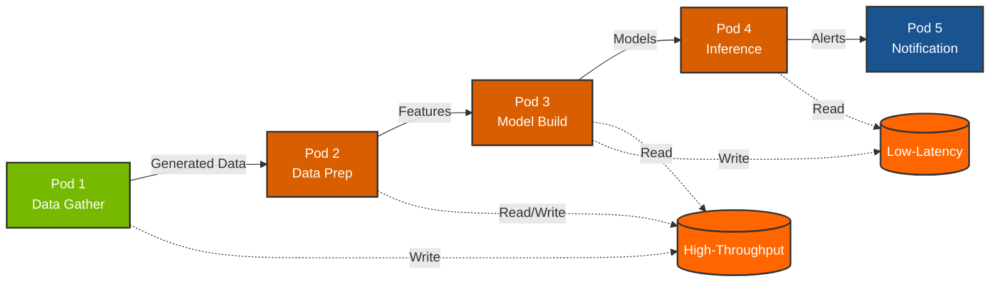

# NVIDIA Financial Fraud Detection Pipeline

[](https://www.nvidia.com/)
[](https://www.docker.com/)
[](https://rapids.ai/)
[](https://www.purestorage.com/)

## Overview

A containerized fraud detection pipeline optimized for dual NVIDIA L40S GPUs and Pure Storage. This project re-architects the [NVIDIA Financial Fraud Detection AI Blueprint](https://github.com/NVIDIA-AI-Blueprints/Financial-Fraud-Detection) into 5 independent Docker containers.

---

## System Architecture



---

## 5-Pod Architecture

| Pod | Container | GPU | Purpose |
|-----|-----------|-----|---------|
| 1 | `data-gather` | No | High-throughput synthetic transaction data generation |
| 2 | `data-prep` | 2x L40S | GPU-accelerated ETL (RAPIDS Accelerator for Spark) |
| 3 | `model-build` | 2x L40S | Train GNN and XGBoost models |
| 4 | `inference` | 2x L40S | Real-time fraud detection (Triton Server) |
| 5 | `notification` | No | Handle fraud alerts via webhook |

---

## Storage

**FlashBlade** (High-Throughput Data I/O):
| Mount Point | Purpose |
|-------------|---------|
| `/mnt/datasets/kaggle/creditcardfraud` | Input template (Kaggle creditcard.csv) |
| `/mnt/fsaai-shared/ebiser/fraud-data` | Pod 1 → Pod 2: Generated transaction data |
| `/mnt/fsaai-shared/ebiser/prep_output` | Pod 2 → Pod 3: Prepared features |

**FlashArray** (Low-Latency Model Serving):
| Mount Point | Purpose |
|-------------|---------|
| `~/ebiser/nvidia.financial.fraud.detection` | Pod 3 → Pod 4: Model repository |

---

## Quick Start

```bash
# Build all containers
docker-compose build

# Run full pipeline
docker-compose up
```

---

## Pod 1: Data Gather

Stress-tests FlashBlade with parallel synthetic data generation.

```bash
docker-compose up data-gather

# Example with custom variables
NUM_WORKERS=64 DURATION_SECONDS=180 OUTPUT_FORMAT=parquet docker-compose up data-gather
```

| Variable | Default | Description |
|----------|---------|-------------|
| `NUM_WORKERS` | 128 | Parallel worker processes |
| `DURATION_SECONDS` | 300 | Generation duration |
| `CHUNK_SIZE` | 50000 | Rows per write |
| `OUTPUT_FORMAT` | parquet | parquet, csv, or binary |

**Output:** `run_YYYYMMDD_HHMMSS/` directories with `worker_*.parquet` files

---

## Pod 2: Data Prep

GPU-accelerated ETL using NVIDIA RAPIDS Accelerator for Spark.

```bash
docker-compose up data-prep

# Example: batch mode with custom poll interval
BATCH_MODE=true POLL_INTERVAL=3 NUM_GPUS=2 docker-compose up data-prep
```

| Variable | Default | Description |
|----------|---------|-------------|
| `INPUT_DIR` | `/mnt/.../fraud-data` | Pod 1 output directory |
| `OUTPUT_DIR` | `/mnt/.../prep_output` | Prepared features output |
| `BATCH_MODE` | false | true = process once and exit |
| `POLL_INTERVAL` | 5 | Seconds between directory checks |
| `NUM_GPUS` | 2 | GPUs for Spark RAPIDS |

**Features:**
- Watches for new `run_*` directories from Pod 1
- Standard scaling on V1-V28 PCA features
- Time-based window features (transaction frequency, velocity)
- Interaction features for fraud pattern detection

**Output:** `features_run_YYYYMMDD_HHMMSS.parquet` + metadata JSON

---

## Pod 3: Model Build

Train XGBoost and GNN models on prepared features.

```bash
docker-compose up model-build

# Example with specific features file
FEATURES_FILE=features_run_20240115_143022.parquet docker-compose up model-build
```

---

## Pods 4 & 5: Inference and Notification

Real-time fraud detection with Triton Server.

```bash
docker-compose up inference notification

# Example with debug mode for notification service
DEBUG=true docker-compose up inference notification
```

---

## Monitoring

```bash
# View logs
docker-compose logs -f <service-name>

# GPU usage
watch -n 1 nvidia-smi

# Container stats
docker stats
```

---

## License

Apache License 2.0