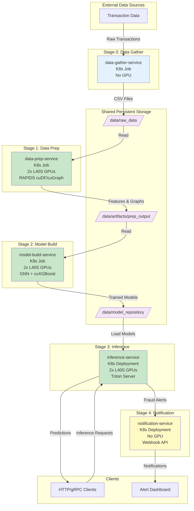

# financial-fraud-demo
## Dual L40S GPU Optimized

[](https://www.nvidia.com/)
[](https://rapids.ai/)
[](https://github.com/triton-inference-server)
[](https://kubernetes.io/)
[](https://www.docker.com/)

## 🌟 Overview

This project re-architects the NVIDIA Financial Fraud Detection AI Blueprint into a highly scalable, containerized, **5-tier microservice pipeline** optimized for **dual NVIDIA L40S GPUs** within a Kubernetes environment.

This project is a **brownfield redevelopment** focusing on **WHY PURE?** of the original solution, which can be found here:

- **Original Blueprint Documentation**: [NVIDIA Financial Fraud Detection](https://docs.nvidia.com/ai-blueprints/)
- **Original GitHub Repository**: [NVIDIA-AI-Blueprints/Financial-Fraud-Detection](https://github.com/NVIDIA-AI-Blueprints/Financial-Fraud-Detection)

The design focuses on **decoupling the core machine learning workflow**—data gathering, high-speed data preparation, distributed training, and real-time inference—into distinct, independently deployable services, ideal for demonstrating performance and scalability, particularly concerning **high-speed I/O with Pure Storage mounts**.

---

## 📋 Table of Contents

- [System Architecture](#-system-architecture)
- [Architecture Details](#️-architecture-5-tier-microservices-breakdown)
- [Key Technology Stack](#-key-technology-stack)
- [Data Flow and Persistence](#-data-flow-and-persistence)
- [Prerequisites](#-prerequisites)
- [Installation](#-installation)
- [Deployment Strategy](#️-deployment-strategy)
  - [Phase 1: Local Validation](#phase-1-local-validation-docker-compose)
  - [Phase 2: Kubernetes Deployment](#phase-2-scalable-deployment-kubernetes)
- [Usage](#-usage)
- [Monitoring and Performance](#-monitoring-and-performance)
- [Troubleshooting](#-troubleshooting)
- [Contributing](#-contributing)
- [License](#-license)
- [Acknowledgments](#-acknowledgments)

---

## 🗺️ System Architecture

This diagram illustrates the data flow between the 5 distinct microservices and the shared storage, showing exactly where the dual L40S GPUs are utilized.



---

## ⚙️ Architecture: 5-Tier Microservices Breakdown

The pipeline is organized into **five sequential or continuously running containers**, with explicit GPU allocation designed to maximize the utilization of your dual L40S system.

| Stage | Service Name | Container Type | Primary GPU Allocation | Core Responsibility |
|-------|--------------|----------------|------------------------|---------------------|
| **0. Gather** | `data-gather-service` | K8s Job | None | Generates/Ingests raw transactional data and persists it to the shared volume. |
| **1. Prep** | `data-prep-service` | K8s Job | **Dual L40S (2x)** | High-Speed I/O Test. GPU-accelerated feature engineering and graph creation via RAPIDS (cuDF/cuGraph), maximizing I/O bandwidth. |
| **2. Build** | `model-build-service` | K8s Job | **Dual L40S (2x)** | Distributed GNN and cuXGBoost training, saving all model artifacts to the Triton Model Repository. |
| **3. Serve** | `inference-service` | K8s Deployment | **Dual L40S (2x)** | Real-time, low-latency fraud scoring using NVIDIA Triton Inference Server (HTTP/gRPC endpoints). |
| **4. Notify** | `notification-service` | K8s Deployment | None | Provides a dedicated webhook (`/notify/fraud`) for receiving high-risk transaction alerts from the Inference Service. |

---

## 🚀 Key Technology Stack

This project leverages the following technologies to achieve high-performance operation:

| Component | Technology | Rationale |
|-----------|-----------|-----------|
| **GPUs** | NVIDIA L40S (2x) | The foundation for high-performance compute in all intensive stages (Prep, Build, Serve). |
| **Data Prep** | RAPIDS (cuDF, cuGraph) | Uses GPU memory and cores to perform data processing at PCIe speeds, bypassing CPU bottlenecks. |
| **Model Training** | RAPIDS (cuXGBoost), PyTorch/TensorFlow | Enables accelerated and potentially distributed training for the GNN and final XGBoost classifier. |
| **Inference** | NVIDIA Triton Inference Server | Provides a standardized, optimized, and scalable serving platform for deep learning and classic ML models. |
| **Orchestration** | Docker Compose, Kubernetes | Offers a validated path from rapid local development to robust cluster deployment. |
| **Persistence** | Shared PVC | Simulates the high-speed connection to Pure Storage mounts (`/data`) for efficient artifact exchange. |

### Technology Versions

```yaml
NVIDIA Driver: >= 525.x
CUDA: 12.x
RAPIDS: 23.10+
Triton Inference Server: 23.10+
Kubernetes: 1.27+
Docker: 24.x+
```

---

## 📦 Data Flow and Persistence

All intermediate data and final models are stored on a **shared Persistent Volume** mounted at `/data` across all containers.

### Data Pipeline Flow

1. **`data-gather`** writes raw CSV to `/data/raw_data/`

2. **`data-prep`** reads the raw CSV and writes prepared features/graphs to `/data/artifacts/prep_output/`

3. **`model-build`** reads the prepared features and writes deployable models to the Triton Model Repository at `/data/model_repository/`

4. **`triton-server`** reads the models directly from `/data/model_repository/` and serves them

5. **`triton-server`** sends high-risk alerts to the notification-service endpoint (e.g., `http://notification-service:5000/notify/fraud`)

### Directory Structure

```
/data/
├── raw_data/
│   └── transactions.csv
├── artifacts/
│   └── prep_output/
│       ├── features.parquet
│       ├── graph_nodes.csv
│       └── graph_edges.csv
└── model_repository/
    ├── fraud_gnn/
    │   ├── config.pbtxt
    │   └── 1/
    │       └── model.pt
    └── fraud_xgboost/
        ├── config.pbtxt
        └── 1/
            └── model.json
```

---

## 📋 Prerequisites

Before you begin, ensure you have the following:

### Hardware Requirements

- **2x NVIDIA L40S GPUs** (48GB VRAM each)
- **128GB+ System RAM** (recommended)
- **1TB+ NVMe Storage** (for high-speed I/O testing)
- **10Gbps+ Network** (for distributed training scenarios)

### Software Requirements

- **NVIDIA Driver** (>= 525.x)
- **Docker** (>= 24.x)
- **Docker Compose** (>= 2.x)
- **Kubernetes** (>= 1.27) with GPU Operator installed
- **kubectl** (matching your cluster version)
- **NVIDIA Container Toolkit**
- **Pure Storage CSI Driver** (if using Pure Storage FlashBlade)

### Verify GPU Installation

```bash
# Check NVIDIA driver
nvidia-smi

# Verify Docker GPU access
docker run --rm --gpus all nvidia/cuda:12.2.0-base-ubuntu22.04 nvidia-smi

# Check Kubernetes GPU nodes
kubectl get nodes -o custom-columns=NAME:.metadata.name,GPUs:.status.capacity.'nvidia\.com/gpu'
```

---

## 🔧 Installation

### 1. Clone the Repository

```bash
git clone https://github.com/yourusername/nvidia-fraud-detection-pipeline.git
cd nvidia-fraud-detection-pipeline
```

### 2. Project Structure

```
nvidia-fraud-detection-pipeline/
├── docker-compose.yaml
├── k8s_manifests.yaml
├── services/
│   ├── data-gather/
│   │   ├── Dockerfile
│   │   └── gather.py
│   ├── data-prep/
│   │   ├── Dockerfile
│   │   └── prep.py
│   ├── model-build/
│   │   ├── Dockerfile
│   │   └── train.py
│   ├── inference/
│   │   ├── Dockerfile
│   │   └── triton-config/
│   └── notification/
│       ├── Dockerfile
│       └── app.py
├── configs/
│   └── model_configs/
├── scripts/
│   ├── build_all.sh
│   └── deploy_k8s.sh
└── README.md
```

### 3. Build Container Images

```bash
# Build all service images
./scripts/build_all.sh

# Or build individually
docker build -t data-gather:latest ./services/data-gather
docker build -t data-prep:latest ./services/data-prep
docker build -t model-build:latest ./services/model-build
docker build -t inference:latest ./services/inference
docker build -t notification:latest ./services/notification
```

### 4. Configure Shared Storage

#### For Docker Compose (Local)

```bash
# Create local data directory
mkdir -p ./data/{raw_data,artifacts/prep_output,model_repository}
```

#### For Kubernetes (Cluster)

```yaml
# Create PVC (example for Pure Storage)
apiVersion: v1
kind: PersistentVolumeClaim
metadata:
  name: fraud-detection-data
spec:
  accessModes:
    - ReadWriteMany
  storageClassName: pure-file
  resources:
    requests:
      storage: 500Gi
```

```bash
kubectl apply -f k8s/pvc.yaml
```

---

## 🛠️ Deployment Strategy

The project follows a **two-phase deployment strategy**:

### Phase 1: Local Validation (Docker Compose)

Before deploying to Kubernetes, the entire pipeline should be built and executed locally using the provided `docker-compose.yaml`. This step is crucial for:

- ✅ Validating container images and resource allocation
- ✅ Testing the sequential execution and inter-service data dependencies
- ✅ Confirming GPU access and functionality on the host machine

#### Run Local Pipeline

```bash
# Start the entire pipeline
docker-compose up

# Run stages individually
docker-compose up data-gather
docker-compose up data-prep
docker-compose up model-build
docker-compose up inference notification
```

#### Verify Local Deployment

```bash
# Check GPU utilization
nvidia-smi

# View logs
docker-compose logs -f data-prep

# Test inference endpoint
curl -X POST http://localhost:8000/v2/models/fraud_xgboost/infer \
  -H "Content-Type: application/json" \
  -d @sample_transaction.json
```

---

### Phase 2: Scalable Deployment (Kubernetes)

Once local validation is complete, the `k8s_manifests.yaml` file defines the full production environment, including:

- **K8s Jobs** for the batch stages (Gather, Prep, Build)
- **K8s Deployments** and **Services** for the continuous services (Inference, Notification)
- **Explicit GPU resource requests** (`nvidia.com/gpu: 2`) to leverage the dual-L40S system effectively within your cluster

#### Deploy to Kubernetes

```bash
# Deploy all manifests
kubectl apply -f k8s_manifests.yaml

# Or use the deployment script
./scripts/deploy_k8s.sh
```

#### Monitor Deployment

```bash
# Check job status
kubectl get jobs -n fraud-detection

# Monitor pod status
kubectl get pods -n fraud-detection -w

# View pod logs
kubectl logs -f <pod-name> -n fraud-detection

# Check GPU allocation
kubectl describe pod <pod-name> -n fraud-detection | grep -A 5 "Limits"
```

#### Kubernetes Manifest Example

```yaml
apiVersion: batch/v1
kind: Job
metadata:
  name: data-prep-job
  namespace: fraud-detection
spec:
  template:
    spec:
      restartPolicy: OnFailure
      containers:
      - name: data-prep
        image: data-prep:latest
        resources:
          limits:
            nvidia.com/gpu: 2  # Request both L40S GPUs
          requests:
            memory: "64Gi"
            cpu: "16"
        volumeMounts:
        - name: shared-data
          mountPath: /data
      volumes:
      - name: shared-data
        persistentVolumeClaim:
          claimName: fraud-detection-data
```

---

## 🎯 Usage

### Running the Complete Pipeline

#### 1. Data Gathering

```bash
# Local
docker-compose up data-gather

# Kubernetes
kubectl create job data-gather-$(date +%s) \
  --from=cronjob/data-gather -n fraud-detection
```

#### 2. Data Preparation

```bash
# Local
docker-compose up data-prep

# Kubernetes
kubectl create job data-prep-$(date +%s) \
  --from=cronjob/data-prep -n fraud-detection
```

#### 3. Model Training

```bash
# Local
docker-compose up model-build

# Kubernetes
kubectl create job model-build-$(date +%s) \
  --from=cronjob/model-build -n fraud-detection
```

#### 4. Start Inference Service

```bash
# Local
docker-compose up -d inference notification

# Kubernetes (already deployed as Deployment)
kubectl get svc inference-service -n fraud-detection
```

### Making Inference Requests

#### HTTP Inference Request

```bash
curl -X POST http://inference-service:8000/v2/models/fraud_xgboost/infer \
  -H "Content-Type: application/json" \
  -d '{
    "inputs": [{
      "name": "input_features",
      "shape": [1, 50],
      "datatype": "FP32",
      "data": [0.5, 0.3, 0.8, ...]
    }]
  }'
```

#### gRPC Inference Request (Python)

```python
import tritonclient.grpc as grpcclient
import numpy as np

client = grpcclient.InferenceServerClient(url="inference-service:8001")

inputs = []
inputs.append(grpcclient.InferInput("input_features", [1, 50], "FP32"))
inputs[0].set_data_from_numpy(np.random.rand(1, 50).astype(np.float32))

outputs = []
outputs.append(grpcclient.InferRequestedOutput("fraud_score"))

results = client.infer(model_name="fraud_xgboost", inputs=inputs, outputs=outputs)
print(f"Fraud Score: {results.as_numpy('fraud_score')}")
```

---

## 📊 Monitoring and Performance

### Performance Metrics

| Metric | Target | Measurement |
|--------|--------|-------------|
| **Data Prep Throughput** | > 1M records/sec | GPU memory bandwidth utilization |
| **Training Time (GNN)** | < 30 minutes | Time to convergence on full dataset |
| **Inference Latency (p99)** | < 10ms | End-to-end prediction time |
| **GPU Utilization** | > 85% | During prep, train, and serve phases |
| **Storage I/O** | > 5GB/s | Read/write to Pure Storage mount |

### Monitoring Commands

```bash
# Real-time GPU monitoring
watch -n 1 nvidia-smi

# Triton metrics
curl http://inference-service:8002/metrics

# Check inference throughput
kubectl exec -it <triton-pod> -n fraud-detection -- \
  /workspace/install/bin/perf_analyzer \
  -m fraud_xgboost \
  -u inference-service:8001 \
  --concurrency-range 1:8
```

### Prometheus Integration

```yaml
# ServiceMonitor for Triton
apiVersion: monitoring.coreos.com/v1
kind: ServiceMonitor
metadata:
  name: triton-metrics
  namespace: fraud-detection
spec:
  selector:
    matchLabels:
      app: inference-service
  endpoints:
  - port: metrics
    interval: 30s
```

---

## 🐛 Troubleshooting

### Common Issues

#### GPU Not Detected in Containers

```bash
# Verify NVIDIA Container Toolkit
docker run --rm --gpus all nvidia/cuda:12.2.0-base-ubuntu22.04 nvidia-smi

# Check Kubernetes GPU Operator
kubectl get pods -n gpu-operator-resources
```

#### Out of GPU Memory

```bash
# Check GPU memory usage
nvidia-smi --query-gpu=memory.used,memory.total --format=csv

# Reduce batch size in training configs
# Edit: services/model-build/config.yaml
batch_size: 128  # Reduce from 256
```

#### Storage Mount Issues

```bash
# Verify PVC is bound
kubectl get pvc fraud-detection-data -n fraud-detection

# Check mount in pod
kubectl exec -it <pod-name> -n fraud-detection -- df -h /data
```

#### Triton Model Loading Errors

```bash
# Check model repository structure
kubectl exec -it <triton-pod> -n fraud-detection -- \
  ls -R /data/model_repository/

# View Triton logs
kubectl logs -f <triton-pod> -n fraud-detection | grep "model"
```

### Debug Mode

Enable verbose logging:

```yaml
# In k8s_manifests.yaml
env:
- name: LOG_LEVEL
  value: "DEBUG"
- name: TRITON_LOG_VERBOSE
  value: "1"
```

---

## 🤝 Contributing

We welcome contributions! Please follow these guidelines:

### Development Workflow

1. **Fork the repository**

2. **Create a feature branch**
   ```bash
   git checkout -b feature/your-feature-name
   ```

3. **Make your changes**
   - Add tests for new functionality
   - Update documentation
   - Follow existing code style

4. **Test locally**
   ```bash
   docker-compose up
   ```

5. **Commit with descriptive messages**
   ```bash
   git commit -m "feat(data-prep): add support for streaming data"
   ```

6. **Push and create Pull Request**
   ```bash
   git push origin feature/your-feature-name
   ```

### Code Standards

- Python code must follow PEP 8
- Use type hints where applicable
- Add docstrings to all functions
- Include unit tests for new features
- Update README.md for configuration changes

---

## 📄 License

This project is licensed under the **Apache License 2.0** - see the [LICENSE](LICENSE) file for details.

---

## 🙏 Acknowledgments

This project builds upon the foundational work of:

- **NVIDIA AI Blueprints Team** - Original fraud detection architecture
- **NVIDIA RAPIDS Team** - GPU-accelerated data science libraries
- **NVIDIA Triton Team** - High-performance inference serving
- **Pure Storage** - High-speed storage infrastructure partnership

### References

- [NVIDIA Financial Fraud Detection Blueprint](https://docs.nvidia.com/ai-blueprints/)
- [RAPIDS Documentation](https://docs.rapids.ai/)
- [Triton Inference Server](https://github.com/triton-inference-server/server)
- [NVIDIA GPU Operator](https://docs.nvidia.com/datacenter/cloud-native/gpu-operator/)

---

## 📞 Contact

**Project Maintainer**: Your Name

- 📧 Email: your.email@example.com
- 💼 LinkedIn: [Your Profile](https://linkedin.com/in/yourprofile)
- 🐙 GitHub: [@yourusername](https://github.com/yourusername)

**Repository**: [https://github.com/yourusername/nvidia-fraud-detection-pipeline](https://github.com/yourusername/nvidia-fraud-detection-pipeline)

---

## 🎯 Roadmap

- [ ] Add streaming data ingestion support (Kafka integration)
- [ ] Implement A/B testing for model versions
- [ ] Add automated model retraining pipeline
- [ ] Integrate with MLflow for experiment tracking
- [ ] Support for additional GPU architectures (A100, H100)
- [ ] Add comprehensive benchmark suite
- [ ] Develop web-based monitoring dashboard

---