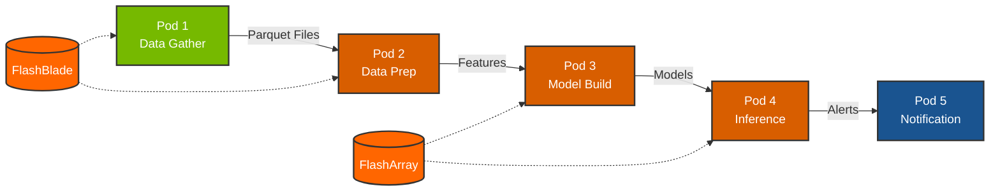

# Fraud Detection Demo

[](https://www.nvidia.com/)
[](https://www.docker.com/)
[](https://rapids.ai/)
[](https://www.purestorage.com/products/unstructured-data-storage/flashblade-s.html)
[](https://www.purestorage.com/products/unified-block-file-storage.html)

A containerized fraud detection pipeline demonstrating high-performance AI/ML workflows on Pure Storage with NVIDIA GPUs.

## Overview

This project implements a financial fraud detection pipeline as a 5-pod containerized architecture, optimized for Pure Storage FlashBlade (high-throughput) and FlashArray (low-latency) storage tiers.

**Key Demonstrations:**
- Pure Storage FlashBlade parallel I/O at 2+ GB/s for data generation
- Multi-GPU processing with RAPIDS cuDF and Dask
- CPU vs GPU performance comparison showing storage isn't the bottleneck
- End-to-end ML pipeline from data generation to real-time inference

## Architecture



**Color Legend:**
- 🟢 **Green**: CPU pod
- 🟠 **Orange**: GPU-accelerated pods  
- 🔵 **Blue**: Support services
- 🟧 **Pure Orange**: Pure Storage

## Pods

| Pod | Container | GPU | Description |
|-----|-----------|-----|-------------|
| 1 | `data-gather` | - | Generates synthetic transaction data at 2+ GB/s |
| 2 | `data-prep` | Multi-GPU | RAPIDS cuDF/Dask feature engineering (CPU vs GPU comparison) |
| 3 | `model-build` | GPU | Trains XGBoost fraud detection model |
| 4 | `inference` | GPU | NVIDIA Triton Inference Server |
| 5 | `notification` | - | Fraud alert webhook service |

## Storage Architecture

This demo showcases Pure Storage tiered storage for AI/ML workloads:

| Storage Tier | Product | Use Case |
|--------------|---------|----------|
| High-Throughput | FlashBlade | Data generation, feature files |
| Low-Latency | FlashArray | Model repository, inference |

### Data Flow

```
FlashBlade: /mnt/fsaai-shared/ebiser/
├── fraud-data/                    # Pod 1 output
│   └── run_YYYYMMDD_HHMMSS/      # Timestamped runs
│       ├── worker_000_00001.parquet
│       └── ...
└── prep-output/                   # Pod 2 output
    ├── features_run_*.parquet    # Engineered features
    └── metadata_run_*.json       # Feature metadata

Model Repository: ./model_repository/
└── fraud_xgboost/                # Pod 3 output, Pod 4 input
    ├── config.pbtxt
    └── 1/xgboost.json
```

## Quick Start

### Prerequisites

- Docker with NVIDIA Container Toolkit
- NVIDIA GPU(s) - tested with 2x L40S
- Pure Storage FlashBlade mount configured

### Build and Run

```bash
# Clone repository
git clone <repository-url>
cd fraud.detection.demo

# Create data directories
sudo mkdir -p /mnt/fsaai-shared/ebiser/fraud-data
sudo mkdir -p /mnt/fsaai-shared/ebiser/prep-output
sudo chmod -R 777 /mnt/fsaai-shared/ebiser/

# Build all containers
make build

# Run full pipeline (data → features → model)
make pipeline

# Start inference server
make inference

# Test inference
make test
```

## Pod Details

### Pod 1: Data Gather

Generates synthetic credit card transactions using pool-based generation for maximum FlashBlade throughput.

**Configuration:**
| Variable | Default | Description |
|----------|---------|-------------|
| `NUM_WORKERS` | 128 | Parallel worker processes |
| `DURATION_SECONDS` | 60 | Generation duration |
| `CHUNK_SIZE` | 1,000,000 | Rows per output file |
| `FRAUD_RATE` | 0.005 | Fraud label rate (0.5%) |

**Example Output:**
```
======================================================================
Pod 1: Financial Fraud Data Generator
======================================================================
Output:   /data/output/run_20251231_183733
Workers:  128
Duration: 60s
Chunk:    1,000,000 rows
Fraud:    0.5%
----------------------------------------------------------------------
[  30s] Files:   384 | Size:  50.00 GB | Speed: 2.01 GB/s | Workers: 128
[  60s] Files:   768 | Size: 100.45 GB | Speed: 1.98 GB/s | Workers: 128
======================================================================
COMPLETE: 768 files | 100.45 GB | 1.67 GB/s avg
======================================================================
```

### Pod 2: Data Prep (Multi-GPU)

GPU-accelerated feature engineering using RAPIDS cuDF with Dask for multi-GPU parallelism.

**CPU vs GPU Comparison:**
Pod 2 runs the same workload twice - first with CPU (pandas), then with GPU (cuDF) - to demonstrate that FlashBlade can saturate GPU processing speeds.

**Example Output:**
```
======================================================================
PERFORMANCE COMPARISON
======================================================================
  Records processed: 50,000,000

  Stage                CPU (s)      GPU (s)      Speedup   
  -------------------- ------------ ------------ ----------
  Data Loading         45.23        8.12         5.6x
  Feature Engineering  32.67        2.34         14.0x
  -------------------- ------------ ------------ ----------
  TOTAL                77.90        10.46        7.4x
======================================================================
```

**Features Added:**
- Amount: `amt_log`, `amt_scaled`
- Time: `hour_of_day`, `day_of_week`, `is_weekend`, `is_night`
- Geography: `distance_km` (customer-merchant Haversine)
- Categorical: `category_encoded`, `state_encoded`, `gender_encoded`
- Other: `city_pop_log`, `zip_region`

**Configuration:**
| Variable | Default | Description |
|----------|---------|-------------|
| `MAX_FILES_PER_RUN` | 100 | Files to process per run |
| `USE_MULTI_GPU` | true | Enable Dask multi-GPU |
| `LATEST_ONLY` | true | Process only newest run |

### Pod 3: Model Build

Trains XGBoost classifier with GPU acceleration.

**Output:**
- Triton-compatible model repository
- FIL backend configuration
- Feature name mapping

### Pod 4: Inference

NVIDIA Triton Inference Server for real-time fraud detection.

**Endpoints:**
| Port | Protocol | Description |
|------|----------|-------------|
| 8000 | HTTP | REST API |
| 8001 | gRPC | High-performance inference |
| 8002 | HTTP | Prometheus metrics |

### Pod 5: Notification

Flask webhook service for fraud alerts.

**Endpoints:**
- `POST /notify/fraud` - Receive fraud alerts
- `GET /alerts` - List recent alerts
- `GET /alerts/stats` - Alert statistics
- `GET /health` - Health check

## Performance Benchmarks

Tested on: 2x NVIDIA L40S, Pure Storage FlashBlade

| Stage | Performance |
|-------|-------------|
| Data Generation | 2.0-2.5 GB/s sustained |
| Feature Engineering (50M rows) | ~140 seconds (CPU) / ~10 seconds (GPU) |
| Model Training (40M rows) | ~17 seconds |
| Inference Latency | <1ms per transaction |

## Configuration

### Environment Variables

Create a `.env` file or export these variables:

```bash
# Storage paths (FlashBlade)
FB_DATA=/mnt/fsaai-shared/ebiser/fraud-data
FB_PREP=/mnt/fsaai-shared/ebiser/prep-output

# Model output
FA_MODEL_REPO=./model_repository

# Pod 1: Data generation
NUM_WORKERS=128
DURATION_SECONDS=60
CHUNK_SIZE=1000000
FRAUD_RATE=0.005

# Pod 2: Feature engineering
MAX_FILES=100
USE_MULTI_GPU=true
LATEST_ONLY=true
```

### Make Commands

| Command | Description |
|---------|-------------|
| `make build` | Build all containers |
| `make pipeline` | Run full pipeline (pods 1-3) |
| `make inference` | Start Triton server |
| `make test` | Test inference endpoint |
| `make stop` | Stop all containers |
| `make clean-data` | Remove generated data |
| `make clean-all` | Full cleanup |
| `make demo` | Quick 1-minute demo |

### Running Individual Pods

```bash
# Run data generation only
make pod1

# Custom duration
DURATION=300 NUM_WORKERS=256 make pod1

# Run feature engineering
make pod2

# Run model training
make pod3
```

## Transaction Schema

The pipeline generates realistic credit card transactions with 23 columns:

| Column | Type | Description |
|--------|------|-------------|
| trans_date_trans_time | datetime | Transaction timestamp |
| cc_num | int64 | Credit card number |
| merchant | string | Merchant name |
| category | string | Transaction category |
| amt | float | Transaction amount |
| first, last | string | Customer name |
| gender | string | M/F |
| street, city, state, zip | string/int | Customer address |
| lat, long | float | Customer coordinates |
| city_pop | int | City population |
| job | string | Customer occupation |
| dob | string | Date of birth |
| trans_num | string | Transaction ID |
| unix_time | int64 | Unix timestamp |
| merch_lat, merch_long | float | Merchant coordinates |
| is_fraud | int8 | Fraud label (0/1) |
| merch_zipcode | int | Merchant zip code |

## Troubleshooting

### GPU not detected

```bash
# Verify NVIDIA runtime
docker run --rm --gpus all nvidia/cuda:12.0.0-base-ubuntu22.04 nvidia-smi
```

### Permission errors on FlashBlade

```bash
# Fix mount permissions
sudo chmod -R 777 /mnt/fsaai-shared/ebiser/
```

### Out of memory errors

```bash
# Reduce files per run
MAX_FILES=25 make pod2
```

### Model not loading in Triton

```bash
# Verify model structure
ls -la ./model_repository/fraud_xgboost/
ls -la ./model_repository/fraud_xgboost/1/

# Check config format
cat ./model_repository/fraud_xgboost/config.pbtxt
```

## License

Apache License 2.0

## Acknowledgments

- [NVIDIA Financial Fraud Detection Blueprint](https://github.com/NVIDIA-AI-Blueprints/Financial-Fraud-Detection)
- [RAPIDS AI](https://rapids.ai/)
- [Pure Storage](https://www.purestorage.com/)
- [Kaggle Credit Card Dataset](https://www.kaggle.com/datasets/priyamchoksi/credit-card-transactions-dataset?resource=download)